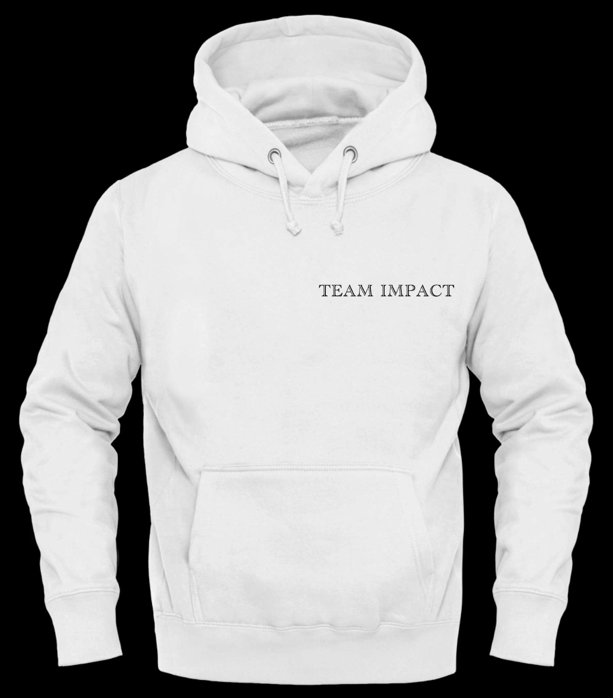

<!DOCTYPE html>
<html lang="en">
<head>
    <meta charset="UTF-8">
    <meta name="viewport" content="width=device-width, initial-scale=1.0">
    <title>Shirts & Hoodies</title>
    <link href="https://fonts.googleapis.com/css2?family=Poppins:wght@400;600&display=swap" rel="stylesheet">
    <link rel="stylesheet" href="https://cdnjs.cloudflare.com/ajax/libs/font-awesome/6.0.0-beta3/css/all.min.css">
    
</head>
<body>

    <!-- Header Section -->
    <header>
        <h1>Styles</h1>
        
by: Team Impact

    </header>

    <!-- Hero Section -->
    <section class="hero">
        

            <h2>Discover Our Latest Styles</h2>
            <button onclick="window.location.href='#home'">Shop Now</button>
        

    </section>

    <!-- Search Bar -->
    

        <input type="text" placeholder="Search..." id="search-input">
        <button onclick="searchFunction()">Search</button>
    

    <!-- Main Content Section -->
    <section id="home">
        

            <button onclick="showTab('shirts')" id="shirts-btn">Shirts</button>
            <button onclick="showTab('hoodies')" id="hoodies-btn">Hoodies</button>
            <button onclick="toggleOrderInfo()">Order</button>
        

        <!-- Shirt Tab Content -->
        

            

                
                <h3>Shirt 1</h3>
                
$15.00

                <button>Add to Cart</button>
            

            

                
                <h3>Shirt 2</h3>
                
$15.00

                <button>Add to Cart</button>
            

            

                
                <h3>Shirt 3</h3>
                
$15.00

                <button>Add to Cart</button>
            

        

        <!-- Hoodie Tab Content -->
        

            

                
                <h3>Hoodie 1</h3>
                
$20.00

                <button>Add to Cart</button>
            

            

                
                <h3>Hoodie 2</h3>
                
$20.00

                <button>Add to Cart</button>
            

        

        <!-- Testimonials Section -->
        

            <h2>Full refund on what you don't like!</h2>
            

                
"You will appreciate the time and effort we invest into our quality"

                
- Abdullah, k

            

        

    </section>

    <!-- Lightbox Overlay -->
    

        
        <button class="close-btn" onclick="closeLightbox()">X</button>
    

    <!-- Order Info Section (Popup) -->
    

        <h2>Ordering</h2>
        

            
            
            
            
        

    

    <!-- Back to Top Button -->
    <button class="back-to-top" onclick="window.scrollTo({ top: 0, behavior: 'smooth' })">↑</button>

    <!-- Footer Section -->
    <footer>
        
&copy; Shirts & Hoodies by Kashif, Abdullah

    </footer>

    
</body>
</html>

